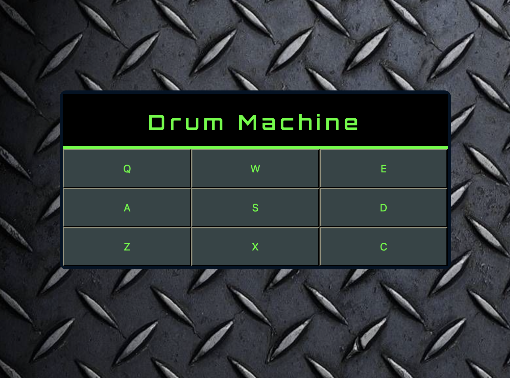

# Drum Machine

This was made as part of the freeCodeCamp Front End Development Libraries curriculum.

## How to Use:

Click on the different beatpads with your mouse or use your keyboard to activate them.

To see this live, please visit its CodePen page: https://codepen.io/macgirl212/full/KKqMQYm
